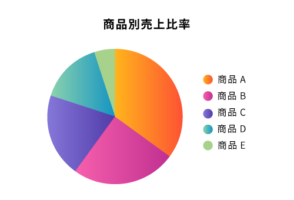
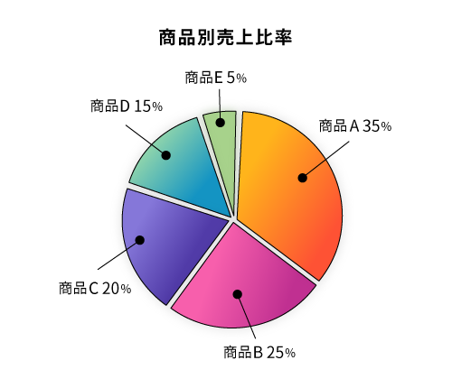

このページでは、アクセシビリティを確保するために最低限達成するべき「[WCAG 2.1](https://waic.jp/docs/WCAG21/)適合レベルA」のうち、基本的な内容のみ定義しています。  
適合レベルAの達成を目標としますが、プロジェクトの要件や工期、デザインの実現性など、バランスをみて対応範囲を調整します。

## <span class="label-required">必須</span> 構文

仕様に準拠した、文法的に正しいHTMLを使用する。

:::note WCAG 2.1 関連項目

- [4.1.1 構文解析](https://waic.jp/docs/WCAG21/#parsing)

:::

<details open>
<summary>詳細</summary>

スクリーン・リーダーなどの支援技術が、Webページを正確に解析できるよう文法的に正しいHTMLをマークアップします。

HTMLの妥当性は[W3C HTML validator](https://validator.w3.org/nu/)などのツールを使用して検証します。

</details>

## <span class="label-required">必須</span> ランドマークの明示

ページを構成する領域を適切なHTML要素でマークアップする。

:::note WCAG 2.1 関連項目

- [1.3.1 情報及び関係性](https://waic.jp/docs/WCAG21/#info-and-relationships)

:::

<details open>
<summary>詳細</summary>

スクリーン・リーダーなどの支援技術がページの構成を適切にユーザーに提示できるようにするため、`header`、`main`、`nav`、`footer`の各要素を適切にマークアップします。

:::caution BAD

```html
<div class="header">
  ...
</div>
<div class="nav">
  ...
</div>
<div class="main">
  ...
</div>
<div class="footer">
  ...
</div>
```

:::

:::tip GOOD

```html
<header class="header">
  ...
</header>
<nav class="nav">
  ...
</nav>
<main class="main">
  ...
</main>
<footer class="footer">
  ...
</footer>
```

:::

</details>

## <span class="label-required">必須</span> セマンティクス

文書構造を適切にマークアップする。

:::note WCAG 2.1 関連項目

- [1.3.1 情報及び関係性](https://waic.jp/docs/WCAG21/#info-and-relationships)

:::

<details open>
<summary>詳細</summary>

見出し、強調、リスト、段落、テーブルなどのセマンティクスは適切なHTML要素でマークアップします。

全角スペースやカッコ、記号文字 (「【】」「＜＞」「・」「■」など) のテキストを視覚的な表現のために使用することはできません。視覚的な表現はスタイルシートで実装します。

:::caution BAD

```html
<!-- 見出しにh1-h6が使われていない -->
<span style="font-size: 32px; margin: 21px 0;">■ 見出しテキスト</span>

<!-- br要素の連続によって段落また余白が表現されている -->
<p>1つめの段落テキスト<br><br><br>
2つめの段落テキスト</p>

<!-- リストにol、ul、dl要素が使われていない -->
<div>・親リスト項目</div>
<div>　・子リスト項目</div><!-- 全角スペースでインデントを表現している -->
<div>　・子リスト項目</div>

<!-- 見出し行と見出し列にth要素がない -->
<table>
  <tbody>
    <tr>
      <td></td>
      <td>主格</td>
      <td>所有格</td>
      <td>目的格</td>
    </tr>
    <tr>
      <th>一人称単数</th>
      <td>I</td>
      <td>my</td>
      <td>me</td>
    </tr>
    <tr>
      <th>一人称複数</th>
      <td>We</td>
      <td>our</td>
      <td>us</td>
    </tr>
  </tbody>
</table>
```

:::

:::tip GOOD

```html
<h1>見出しテキスト</h1>

<p>1つめの段落テキスト</p>
<p>2つめの段落テキスト</p>

<ul>
  <li>親リスト項目
    <ul>
      <li>子リスト項目</li>
      <li>子リスト項目</li>
    </ul>
  </li>
</ul>

<table>
  <thead>
    <tr>
      <td></td>
      <th>主格</th>
      <th>所有格</th>
      <th>目的格</th>
    </tr>
  </thead>
  <tbody>
    <tr>
      <th>一人称単数</th>
      <td>I</td>
      <td>my</td>
      <td>me</td>
    </tr>
    <tr>
      <th>一人称複数</th>
      <td>We</td>
      <td>our</td>
      <td>us</td>
    </tr>
  </tbody>
</table>
```

:::

</details>

## <span class="label-required">必須</span> 言語コード

`html`要素の`lang`属性にページで使用する主な言語（自然言語）の言語コードを指定する。

:::note WCAG 2.1 関連項目

- [3.1.1 ページの言語](https://waic.jp/docs/WCAG21/#language-of-page)

:::

<details open>
<summary>詳細</summary>

多言語対応している読み上げ環境にてページを読み上げる場合、適切な言語の音声エンジンで読み上げられるよう`lang`属性に言語を指定します。

:::tip GOOD

```html
<!DOCTYPE html>
<html lang="ja">
  ...
```

:::

</details>

## <span class="label-required">必須</span> テキストを含む画像

画像に含まれるテキストと同じ内容の代替テキストを`alt`属性に指定する。

:::note WCAG 2.1 関連項目

- [1.1.1 非テキストコンテンツ](https://waic.jp/docs/WCAG21/#non-text-content)

:::

<details open>
<summary>詳細</summary>

スクリーン・リーダーのユーザーが画像化されたテキストにアクセスできるよう`alt`属性に代替テキストを設定します。

:::tip GOOD

```html


<input type="image" alt="代替テキスト">

<map name="example">
  <area shape="rect" coords="..." href="..." alt="代替テキスト">
  <area shape="circle" coords="..." href="..." alt="代替テキスト">
</map>
```

:::

</details>

## <span class="label-recommend">推奨</span> SVGの代替テキスト

SVGが意味のある画像の場合、`role="img"`と`title`要素で代替テキストを提供する。

:::note WCAG 2.1 関連項目

- [1.1.1 非テキストコンテンツ](https://waic.jp/docs/WCAG21/#non-text-content)

:::

<details open>
<summary>詳細</summary>

SVGが意味のある画像の場合、`role="img"`で画像として認識させた上で`title`要素内に代替テキストを記述します。

:::tip GOOD

```html
<svg role="img">
  <title>代替コンテンツ</title>
  <path d="...">
</svg>
```

:::

</details>

## <span class="label-recommend">推奨</span> 特定の感覚に依存しない表現

形や色など特定の感覚だけを前提とした表現をしない。

:::note WCAG 2.1 関連項目

- [1.3.3 感覚的な特徴](https://waic.jp/docs/WCAG21/#sensory-characteristics)

:::

<details open>
<summary>詳細</summary>

形状、色、大きさ、視覚的な位置、方向、音などが分からないと理解できないような表現は避けます。

:::caution BAD

- 「赤字の項目は必須項目です」
- 「右の表を参照してください」
- 「青いボタンを押してください」

:::

:::tip GOOD

- 「赤い※印のついた項目は必須項目です」
- 「右の表（表3）を参照してください」
- 「青い「保存」ボタンを押してください」

:::

</details>

## <span class="label-recommend">推奨</span> 複数の視覚的要素を用いた表現

文字色や図形の色で意図を表現している場合、色以外の要素と併用して表現する。

:::note WCAG 2.1 関連項目

- [1.4.1 色の使用](https://waic.jp/docs/WCAG21/#use-of-color)

:::

<details open>
<summary>詳細</summary>

強調、引用など、何らかの意図を文字色や図形の色を変えることによって表現している場合、書体など他の視覚的な要素も併せて用い、色が判別できなくてもその意味を理解できるようにする。

リンク、グラフなどの図版、入力フォームの必須項目やエラー表示など

:::caution BAD

項目とデータの対応関係が色のみで表現されている



:::

:::tip GOOD

項目とデータを続けて記載したり引き出し線を引くことで、テキストと色で情報が伝えられている



模様と色で情報が伝えられている


:::

</details>

## <span class="label-recommend">推奨</span> 適切なリンクテキスト

リンクテキストは、そのリンクの目的を判断できるものにする。

:::note WCAG 2.1 関連項目

- [2.4.4 リンクの目的 (コンテキスト内)](https://waic.jp/docs/WCAG21/#link-purpose-in-context)

:::

<details open>
<summary>詳細</summary>

リンクテキストが「こちら」などはせず、リンクテキストの内容から遷移先をある程度推測できるようします。  
`a`要素の中に画像しかない場合は必ず代替テキストを設定します。


:::caution BAD

```html
<!-- 「こちら」のみリンクが設定されているため遷移先が予測できない -->
<p>おすすめ保険商品は<a href="detail.html">こちら</a></p>

<!-- a要素の中には画像しか含まれていないが、画像のalt属性値が空 -->
<a href="detail.html"></a>
```

:::

:::tip GOOD

```html
<p><a href="detail.html">おすすめ保険商品はこちら</a></p>

<a href="detail.html"></a>
```

:::

</details>

## <span class="label-recommend">推奨</span> 適切なフォーカス順序

コンテンツの意味に合った適切な順序でフォーカスを移動させる。

:::note WCAG 2.1 関連項目

- [2.4.3 フォーカス順序](https://waic.jp/docs/WCAG21/#focus-order)

:::

<details open>
<summary>詳細</summary>

TabキーとShift+Tabキーでフォーカスを移動させる際、文脈やレイアウト、操作手順に即した自然な順序でフォーカスが移動するように設定します。

:::caution BAD

- 1ソースのレスポンシブデザインページにてSPとPCで要素の順序が異なる場合
- JavaScriptによるフォーカス制御や`tabindex`属性によりフォーカス順序が固定されている場合

:::

</details>


## <span class="label-recommend">推奨</span> フォーム・コントロールのラベル

フォーム・コントロールには、表示されているテキストをラベルとして明示的に関連付ける。

:::note WCAG 2.1 関連項目

- [1.1.1 非テキストコンテンツ](https://waic.jp/docs/WCAG21/#non-text-content)
- [1.3.1 情報及び関係性](https://waic.jp/docs/WCAG21/#info-and-relationships)
- [2.4.6 見出し及びラベル](https://waic.jp/docs/WCAG21/#headings-and-labels)
- [2.5.3 名前 (name) のラベル](https://waic.jp/docs/WCAG21/#label-in-name)
- [3.3.2 ラベル又は説明](https://waic.jp/docs/WCAG21/#labels-or-instructions)

:::

<details open>
<summary>詳細</summary>

視覚障害者が、フォーム・コントロールの目的を容易に判断することができるよう、`label`要素で画面上に表示されているテキスト（または代替テキストが付加された画像）をラベルとして設定します。

該当するラベルがない場合は`title`属性により入力欄の目的を設定します。

入力例、入力形式、「必須」「任意」などの補足情報は入力欄より前（見た目上の位置、ソース上の位置）にあることが望ましいです。

:::caution BAD

```html
<!-- ラベルで関連付けされていない -->
<p>氏名 <input type="text"></p>

<!-- ラベルで関連付けされていない -->
<!-- ラベルがない入力テキスト（2つめのinput要素）にtitleが設定されていない -->
<!-- 「必須」の補足情報がラベルの後にある -->
<table>
<tbody>
<tr>
<th>郵便番号 <strong>必須</strong></th>
<td><input type="text"><input type="text"></td>
</tr>
</tbody>
</table>

<!-- ラベルがない入力テキストにtitleが設定されていない -->
<select>
  <option value="japan">日本</option>
  <option value="other">日本以外</option>
</select>
```

:::

:::tip GOOD

```html
<!-- label要素で囲う -->
<p><label>氏名 <input type="text"></label></p>

<!-- label要素とinput要素が離れている場合はfor属性でidを指定する -->
<!-- ラベルがない入力テキスト（2つめのinput要素）にはtitle属性で入力欄の目的を設定する -->
<!-- label要素1つに対してinput要素が2つある場合は最初の1つと関連付ける -->
<table>
<tbody>
<tr>
<th><label for="zip"><strong>必須</strong> 郵便番号</label></th>
<td><input type="text" id="zip" title="郵便番号 冒頭3桁"><input type="text" title="郵便番号 末尾4桁"></td>
</tr>
</tbody>
</table>

<!-- ラベルがない入力テキストにはtitle属性で入力欄の目的を設定する -->
<select title="国籍">
  <option value="japan">日本</option>
  <option value="other">日本以外</option>
</select>
```

:::

</details>

## <span class="label-recommend">推奨</span> フォーカス時の挙動

Tabキーによるフォーカス移動時に、新しいウィンドウが開いたり、別のページに遷移したり、ページ全体がリロードされるなどの状況の変化を起こさない。

:::note WCAG 2.1 関連項目

- [3.2.1 フォーカス時](https://waic.jp/docs/WCAG21/#on-focus)

:::

<details open>
<summary>詳細</summary>

TabキーとShift+Tabキーでフォーカスを移動させる際、以下のような変化を発生させないようにします。

- フォームの送信
- レイアウトの変更
- ページの遷移
- モーダル・ダイアログの表示
- 表示内容の大幅な変更、など

</details>

## <span class="label-recommend">推奨</span> 入力時の挙動

フォームに入力/選択する操作により、新しいウィンドウが開いたり、別のページに遷移したり、ページ全体がリロードされるなどの状況の変化を起こさない。

:::note WCAG 2.1 関連項目

- [3.2.2 入力時](https://waic.jp/docs/WCAG21/#on-input)

:::

<details open>
<summary>詳細</summary>

フォームに入力/選択する操作により、コンテンツの意味の変更、ページ全体に及ぶような変化が発生する場合は事前にユーザーに知らせる必要があります。

入力値や選択値に応じてページの一部分が書き換わる（入力欄が増えたり選択肢が変化する）場合は該当しません。  
ただし、そのような可変の入力欄がある場合はソース上の位置やフォーカス順序に注意する必要があります（[1.3.2 意味のある順序](https://waic.jp/docs/WCAG21/#meaningful-sequence)、[2.4.3 フォーカス順序](https://waic.jp/docs/WCAG21/#focus-order)）

:::caution BAD

- 選択メニューを選択すると同時に別のページに遷移、あるいはファイルのダウンロードがはじまる場合
- フォームの全項目を入力し終えた時や最後の入力項目からフォーカスがはずれた時に自動的にページ遷移する場合

:::

:::tip GOOD

- 選択メニューを選択してから実行ボタンを押すことにより別のページに遷移、あるいはファイルのダウンロードがはじまる

:::

</details>

## <span class="label-recommend">推奨</span> テキスト情報によるエラーの特定

入力エラーがある場合、エラー箇所とエラー内容をテキストで知らせる。

:::note WCAG 2.1 関連項目

- [3.3.1 エラーの特定](https://waic.jp/docs/WCAG21/#error-identification)

:::

<details open>
<summary>詳細</summary>

視覚障害者、色弱者がエラー箇所を特定できるように、エラー内容が分かる具体的なテキスト情報を表示します。

:::caution BAD

- 「必須項目が入力されていません」のような具体的な項目名を示していないメッセージ
- 「エラーがあります」のような、エラーの理由（必須項目を入力していない、入力形式が違っている、桁数が違っているなど）が不明確なメッセージ
    - ※ 認証画面などでセキュリティ上の理由で具体的なエラー内容を書かないほうが良いとされる場合もあります

:::

:::tip GOOD

- 「お名前」は必須入力項目です。
- 「パスワード」の入力形式が不正です。全角文字を使用することはできません。
- 「郵便番号 冒頭3桁」をご入力ください。
    - 入力欄が複数分かれる場合

:::

</details>

## <span class="label-recommend">推奨</span> 動き、点滅、スクロールを伴うコンテンツ

同じページ上に、自動的に開始し5秒以上継続する、点滅やスクロールを伴うコンテンツと、他のコンテンツを一緒に配置しない。  
5秒以内に自動的に停止しない場合は、ユーザーが一時停止、停止、または非表示にすることができるようにする。

:::note WCAG 2.1 関連項目

- [2.2.2 一時停止、停止、非表示](https://waic.jp/docs/WCAG21/#pause-stop-hide)

:::

<details open>
<summary>詳細</summary>

ウィンドウ全面に表示される広告やローディング画面など、その他の情報とは同時に表示されないコンテンツの場合は該当しません。

:::caution BAD

- 自動的に情報が更新され、一時停止、停止、もしくは非表示にする手段のないニュースティッカー
- 一定時間で表示が切り替わり、一時停止、停止、もしくは非表示にする手段のないカルーセル

:::

</details>

## <span class="label-recommend">推奨</span> WAI-ARIAは必要十分かつ最小限

WAI-ARIAを利用する場合は必要十分かつ最小限に留める。

<details open>
<summary>詳細</summary>

WAI-ARIAは利用方法を誤ると支援技術のユーザーに情報が伝わらなかったり操作できなくなったりするため、HTMLで表現できるセマンティクスはHTMLで表現します。

:::caution BAD

```html
<span role="button" tabindex="0">ボタン</span>
```

:::

:::tip GOOD

```html
<button type="button">ボタン</button>
```

:::

</details>
